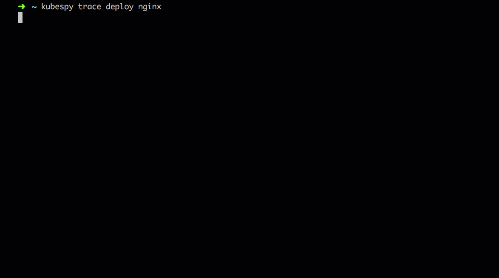

# kubespy: tools for observing Kubernetes resources in real time

What happens when you boot up a `Pod`? What happens to a `Service` before it is allocated a public
IP address? How often is a `Deployment`'s status changing?

**`kubespy` is a small tool that makes it easy to observe how Kubernetes resources change in real
time,** derived from the work we did to make Kubernetes deployments predictable in [Pulumi's CLI](https://www.pulumi.com/kubernetes/). Run `kubespy` at any point in time, and it will watch and report information about a
Kubernetes resource continuously until you kill it.

## Examples

`kubespy trace deployment nginx` will "trace" the complex changes a complex Kubernetes resource
makes in the cluster (in this case, a `Deployment` called `nginx`), and aggregate them into a
high-level summary, which is updated in real time.



`kubespy status v1 Pod nginx` will wait for a `Pod` called `nginx` to be created, and then continuously emit changes made to its `.status` field, as syntax-highlighted JSON diffs:


## Installation

You can install kubespy in three ways:

### Binary

Get the [latest release](https://github.com/pulumi/kubespy/releases),
rename it to `kubespy`, run `chmod +x kubespy` to make it executable and move it in your path (can be /usr/local/bin).

### Kubectl Plugin

Prerequisite: kubectl v1.12.0 or later

With kubectl v1.12.0 introducing [easy pluggability](https://kubernetes.io/docs/tasks/extend-kubectl/kubectl-plugins/) of external functions, kubespy can be invoked as `kubectl spy` just by renaming it to `kubectl-spy` and having it available in your path.

### via Golang

Prerequisite: [Go](https://golang.org/) version 1.11 or later

kubespy can be installed via golang by running the following:

```sh
export GO111MODULE=on

# If $GOBIN is not on your path, you'll need to install the library elsewhere.
go install github.com/pulumi/kubespy
```

## Usage

`kubespy` has three commands:

-   `status <apiVersion> <kind> [<namespace>/]<name>`, which in real time emits all changes made to
    the `.status` field of an arbitrary Kubernetes resource, as a JSON diff.
-   `changes <apiVersion> <kind> [<namespace>/]<name>`, which in real time emits all changes to any
    field in a Kubernetes resource, as a JSON diff.
-   `trace <kind> [<namespace>/]<name>`, which "traces" the changes a complex Kubernetes resource
    makes throughout a cluster, and aggregates them into a high-level summary, which is updated in
    real time.

Several more commands are planned as well.

## Examples

For a concrete example you can run using either Pulumi or `kubectl`, check out [examples/trivial-pulumi-example](https://github.com/pulumi/kubespy/tree/master/examples/trivial-pulumi-example).

## Features

-   [x] Supports any resources the API server knows about, including CRDs (_i.e._, uses the discovery
        client to discover the available API resources, and allows users to query any of them).
-   [x] Displays changes to API objects in real time.
-   [ ] Supports case-insensitive aliases (_e.g._ `kubespy status v1 pod <name>` instead of
        `kubespy status v1 Pod <name>`).
-   [ ] Supports status updates from regex and/or fuzzy matching (_i.e._, make it easy to watch the
        status of `Pod`s generated by `Deployment`s and `ReplicaSet`s).
