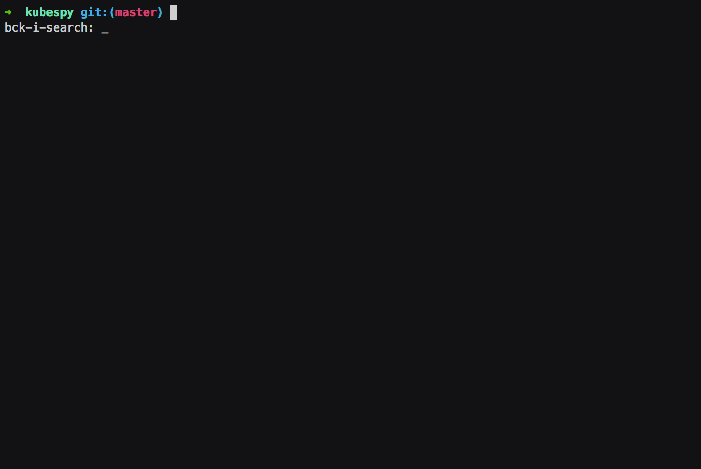

# Example: What happens when you boot up a Pod?

In this example, we:

-   Install a simple `Pod` to a Kubernetes cluster.
-   Use `kubespy` to watch what happens to that `Pod` as it starts.

You'll need:

-   **Access to a Kubernetes cluster.** If you are using Pulumi, you can trivially boot an [GKE](https://github.com/pulumi/examples/tree/master/gcp-ts-gke), [AKS](https://github.com/pulumi/examples/tree/master/azure-ts-aks-mean), or [EKS](https://github.com/pulumi/examples/tree/master/aws-ts-eks) cluster. You can also use [minikube](https://github.com/kubernetes/minikube).
-   **Either the Pulumi CLI or `kubectl`.** There is nothing Pulumi-specific in this example, so you can use `kubectl`, but we hope you'll give Pulumi a shot! The CLI installation instructions [here](https://pulumi.io/quickstart/install.html). Pulumi works anywhere `kubectl` works (i.e., anywhere you have a kubeconfig file), so it should "just work" if you already have a Kubernetes cluster running.
-   **`kubespy`.** Installation is a handful of commands, which you can find in the [README](https://github.com/pulumi/kubespy#installation).

Once these are complete, you'll want to do two things:

1. **Run `kubespy`.** Once you've installed it, this should be as simple as
   `kubespy status v1 Pod nginx`. `kubespy` will dutifully wait for you to
   deploy a `Pod` called `nginx` to your cluster.
2. **Run the example.** `kubespy` repository contains a tiny example Pod that
   deploys an NGINX container.

    ```sh
    # With Pulumi CLI.
    $ git clone git@github.com:pulumi/kubespy.git
    $ cd kubespy/examples/trivial-pulumi-example
    $ npm install
    $ pulumi up

    # With kubectl
    kubectl create -f https://github.com/pulumi/kubespy/raw/master/examples/trivial-pulumi-example/yaml/nginx.yaml
    ```

Once done, `kubespy` should display something like this:


